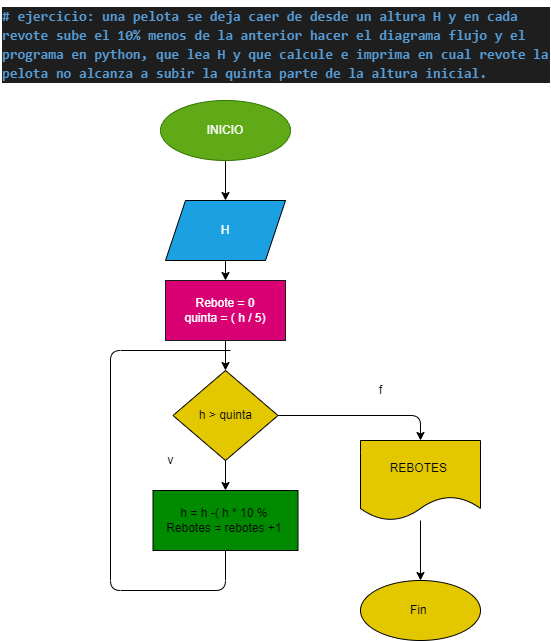

# ejercicio: una pelota se deja caer de desde un altura H y en cada revote sube el 10% menos de la anterior hacer el diagrama flujo y el programa en python, que lea H y que calcule e imprima en cual revote la pelota no alcanza a subir la quinta parte de la altura inicial.

## Diagrama de flujo ejercicios

